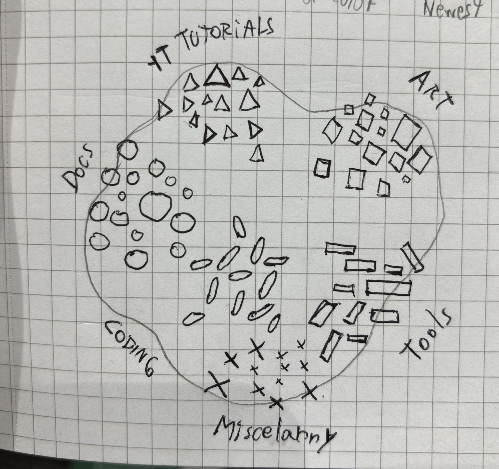
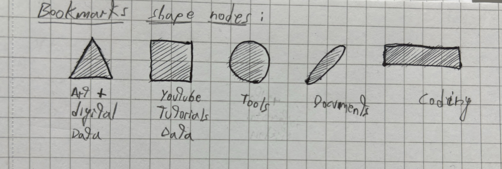
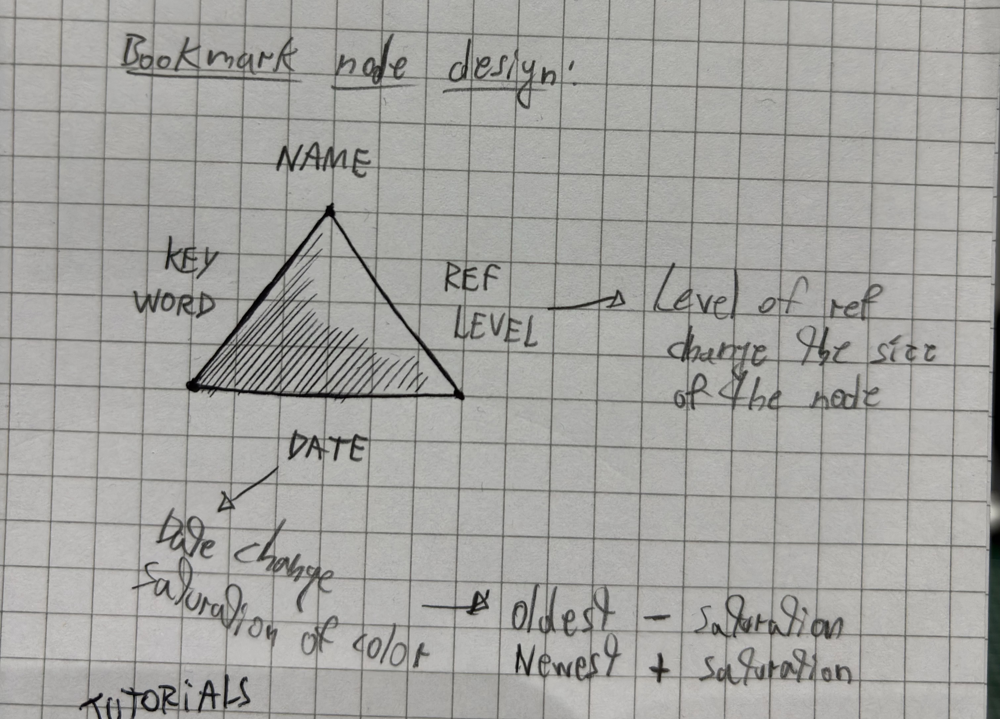

# :bookmark_tabs: B00km4rk5_Per5ona1_Atla5

*This is a personal dataset dynamic atlas about some of the web references I have archived over a few years. Each node represents a specific category for the reference. The user can navigates the dynamic atlas and explore each reference as much as they like. Made with **p5.js**, **JSON files** and **Node.js**.*

### Process

*The main idea for this project takes inspiration from "personal Knowledge database" project by the colombian artist and data scientist Santiago Ortiz.*

*I took the bookmark data stored in my browsers (Safari and Chrome), went through a selection process, and transferred the data into a JSON file. Several of the references are more than five years old, from when I was still an undergraduate, which is why they are in Spanish.*

*These are the categories clustered inside the atlas and its respective number of bookmarks:*
- YT tutorials: **90**
- Docs: **42**
- Tools: **28**
- Art: **27**
- Coding: **18**
- Miscellany: **6**

Total: **211**

### Sketches

*Some doodles and sketches about my thinking process for the project, how it would look and its interface:*

### Demo

### Requirements
- Web browser.

### How to Run

*You can also download the repo and run it in your machine localy. **IMPORTANT:** to keep the JSON file in the same project folder.*

- Use the mouse wheel to zoom in/zoom out.
- Drag to pan over the atlas.
- Hover the mouse over any node to highlight it's details.
- Click the node to open the reference in a new tab.

### Links

*GitHub Repo: https://github.com/A-serna0415/workshop3_bookmarks_atlas.git*

*Hosted in Render: https://workshop3-bookmarks-atlas.onrender.com*